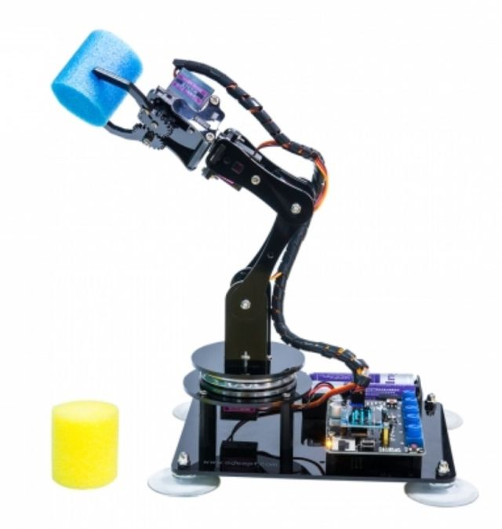
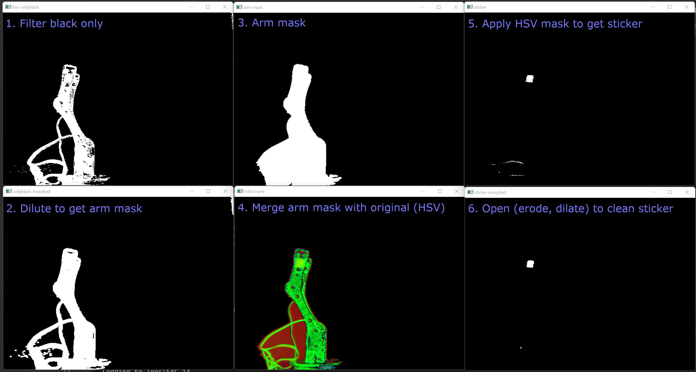
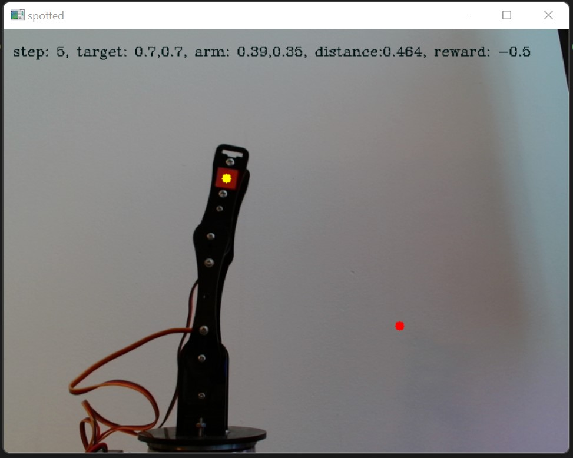
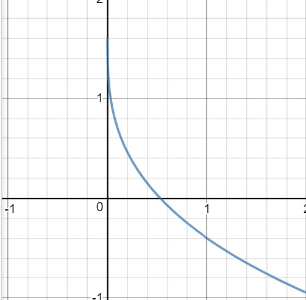

# Assigment: Use reinforcement learning to move a robot arm to a wanted position
The goal of the assigment in to move a robot arm to a certain position in a safe way learned through RL. 

We use an [Adeept robot arm](http://www.adeept.com/robotic-arm-uno_p0118.html).



## Object detection ([RobotArmDetector.py](RobotArmDetector.py))
The positon of robot arm is determined through object detection of a camera image. The openCV library is used for this.
We will determine the object by filtering colors based on their HSV values. 
We start by detecting the complete robot arm which we use as a mask for the complete image, then we search for a red sticker within this masked image and determine the centroid of that sticker (by using moments). Implementation is done in the `RobotArmDetector.py`.



On the image above you can see the different steps that eventually produce a large enough area white area that represents the sticker. By finding the contours of this sticker, we're able get the location of the end of the robot arm.

To be able to visually follow the learning process, we mark the determined location with a yellow dot on the original image.

The target location is marked with a red dot.



The locations are normalized ranging from (0,0) to (1,1)

## Controlling the robot ([RobotArmController.py](RobotArmController.py))
The position of the robot arm is controlled by servo motors. Each servo motor has a 180 degrees range. 

We will work in a 2D space and therefore only use the servo 1 and 2. A servo is set into a position by specifying the desired angle of the servo.

Because the stable baselines agents perform better within an normalized action space, a movement is translated from a (-1,1) action range into an angle. To avoid very large rotations at once, the change in angle per movement is limited.
Experiments were done with interpreting the action as the absolute angle ( new_angle = 90 + action*90 / 18) and with interpreting the action as relative movement of the angle (new_angle = previous_angle + 10 * action). The relative movement seemed to produce more smooth movement.

The action of the environment will be thin the From the `RobotArmController`, the `move_servos()`

## The environment ([RobotArmEnv.py](RobotArmEnv.py))
The custom environment has the following action and observation space
```python
self.observation_space = gym.spaces.Box(low=0.0, high=1.0, shape=(6,), dtype=np.float32)
self.action_space = gym.spaces.Box(low=-1.0, high=1.0, shape=(2,), dtype=np.float32) 
      
```
where the observation space has
 * target location x coordinate
 * target location y coordinate
 * current location x coordinate
 * current location y coordinate
 * servo motor 1 angle (normalized)
 * servo motor 2 angle (normalized)
 
and the action space has
 * servo 1 movement
 * servo 2 movement

### Shaping the reward function  
We started of as simple as possible with just a reward when reaching the target and a constant low negative reward when the target was not reached: As expected difficult to learn anything.

Next step was to bring (Euclidian) distance (between current and target location) and previous distance into the picture: Add a constant negative reward when moving further away then the previous step, this resulted in a bit of a learning but the agent stopped doing anything to avoid negative rewards.

Next step was to introduce a reward inverse related to the distance. When far apart, the reward was still negative. When closer, the reward was positive. By using an exponential function, being close gets much bigger rewards. Being further away, rewards get smaller slower.

```python
reward = 2 * (0.8 - (distance/distance_max) ** 0.35)
```


This got much better results but often the agent still got stuck not doing anything anymore.

Next step was to punish the agent for doing nothing.

