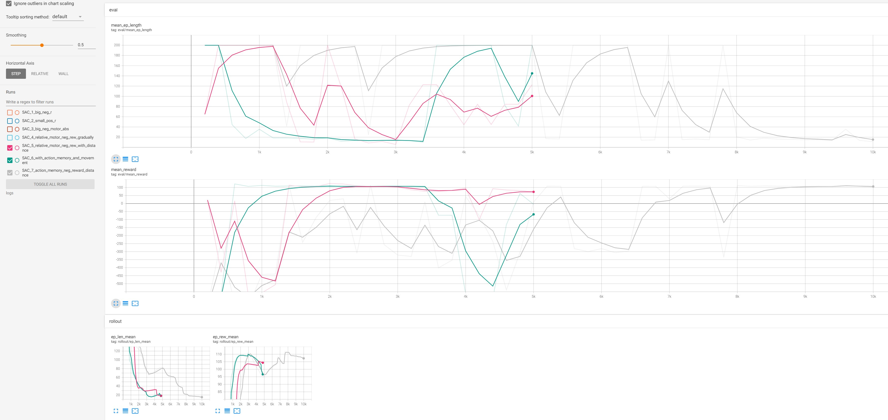

# Assigment: Use reinforcement learning to move a robot arm to a wanted position
The goal of the assigment is to move a robot arm to a certain position in a safe way learned through RL. 

We use an [Adeept robot arm](http://www.adeept.com/robotic-arm-uno_p0118.html).


## Brief summary of the files and how to start
[RobotArmEnv.py](RobotArmEnv.py) contains the environment and a `__main__` to start a learning agent.

Other files are
 * [RobotArmDetector.py](RobotArmDetector.py) contains the object detection and when started as  `__main__` it can be used to set the scene and make sure the robot arm fits well in the camera shot
 * [RobotArmController.py](RobotArmController.py) controls the (serial) communication with the robot arm
 

In the tools folder you can find a [thresholdtool.py](./tools/thresholdtool.py) to create the masks for the robot arm and the sticker.

## Object detection ([RobotArmDetector.py](RobotArmDetector.py))
The positon of robot arm is determined through object detection of a camera image. The openCV library is used for this.
We will determine the object by filtering colors based on their HSV values. 
We start by detecting the complete robot arm which we use as a mask for the complete image, then we search for a red sticker within this masked image and determine the centroid of that sticker (by using moments).


On the image above you can see the different steps that eventually produce a large enough area white area that represents the sticker. By finding the contours of this sticker, we're able get the location of the end of the robot arm.

To be able to visually follow the learning process, we mark the determined location with a yellow dot on the original image.

The target location is marked with a red dot.


The locations are normalized ranging from (0,0) to (1,1)

The `RobotArmDetector` will also write a image sample and an arm mask sample to disk. These can be used by [thresholdtool.py](./tools/thresholdtool.py) to determine the correct values for the mask. Due to different light conditions, the required masks might have to be adapted.

## Controlling the robot ([RobotArmController.py](RobotArmController.py))
The position of the robot arm is controlled by servo motors. Each servo motor has a 180 degrees range. 

We will work in a 2D space and therefore only use the servo 1 and 2. 

A servo is set into a position by specifying the desired angle of the servo.

Because the stable baselines agents perform better within an normalized action space, a movement is translated from a (-1,1) action range into an angle. To avoid very large rotations at once, the change in angle per movement is limited.

Experiments were done with interpreting the action as the absolute angle ( new_angle = 90 + action*90 / 18) and with interpreting the action as relative movement of the angle (new_angle = previous_angle + 10 * action). The relative movement seemed to produce more smooth movement.

The action of the environment will be used in the method `move_servos()` from the `RobotArmController`. 


## The environment ([RobotArmEnv.py](RobotArmEnv.py))
The custom environment has the following action and observation space
```python
self.observation_space = gym.spaces.Box(low=0.0, high=1.0, shape=(6,), dtype=np.float32)
self.action_space = gym.spaces.Box(low=-1.0, high=1.0, shape=(2,), dtype=np.float32) 
      
```
where the observation space has
 * target location x coordinate
 * target location y coordinate
 * current location x coordinate
 * current location y coordinate
 * servo motor 1 angle (normalized)
 * servo motor 2 angle (normalized)
 
and the action space has
 * servo 1 movement
 * servo 2 movement

### Shaping the reward function  
We started of as simple as possible with a fixed target location and just a reward when reaching the target and a constant low negative reward when the target was not reached: As expected difficult to learn anything.

Next step was to bring (Euclidian) distance (between current and target location) and previous distance into the picture: Add a constant negative reward when moving further away then the previous step, this resulted in a bit of a learning but the agent stopped doing anything to avoid negative rewards.

Next step was to introduce a reward inverse related to the distance. When far apart, the reward was still negative. When closer, the reward was positive. By using an exponential function, being close gets much bigger rewards. Being further away, rewards get smaller slowly.

```python
reward = 2 * (0.8 - (distance/distance_max) ** 0.35)
```


This got much better results but often the agent still got stuck not doing anything anymore.

Next step was to give negative rewards for standing still. Different algorithms were tried in the following order:

 1. A negative constant reward when standing still (based on current location). The reward for standing still was higher then for moving (even moving in the wrong direction). Nevertheless the arm still often did not move for quite some time.
 2. An negative reward increasing per timestep (topped at a certain value) based on the servo motor angle. This give slightly better results but negative rewards grew fast to the topped value and then remained constant. This was easily fixed by introducing a division by the max timesteps within an episode. This lead to the arm making very small movements back and forward to score rewards from getting back into that position with a good reward based on its closeness to the target. 
 3. A next refinement was made by introducing distance within the negative reward for standing still. The further away the arm, the faster the negative reward will grow when standing still.
 4. To make this opportunistic behavior harder, we introduced a memory buffer of x previous motor angles and compared the mean angle with the new action to see if there was a real movement. This reduced the back and forward movements a lot.
 
The resulting 'hart' of the reward function looks like:
 ```python
         if distance < 0.04:
            reward = 100
            done = True
            print('Target reached!')
        elif any_movement:
            reward = 2*(0.8 - (distance/distance_max)**0.35)
        else:
            reward = -1 + (-10) * float(np.max([0.2, distance])) * self.stand_still_count/self.timsteps_max

        if self.timestep == self.timsteps_max:
            reward = -10
            done = True
 ```

Next we'll show some of the learning curves in tensorboard:



We are showing the episode length and mean reward for 3 different reward functions:

 * `SAC_5_relative_motor_neg_rew_with_distance` is the one described in 3.
 * `SAC_6_with_action_memory_and_movement` is the one described in 4. and with changes in target starting from 3000 time steps
 * `SAC_7_action_memory_neg_reward_distance` is also the one described in 4. trained for 10000 time steps. At a certain moment, the robot arm platform moved quite a bit which decreased performance for a while

 We can see that all 3 are learning.

 You can find a video of the last part of the learning process on [https://user-images.githubusercontent.com/120823/174502454-50634c85-f32a-45c3-bfc6-4cd5c39660d9.mp4](https://user-images.githubusercontent.com/120823/174502454-50634c85-f32a-45c3-bfc6-4cd5c39660d9.mp4).

## Changing the target location

The target location is part of the observation space. After a few experiments with changing the target location, we noticed that the further we are in the learning, the harder it is to change the target. Targets in the neighbourhood of the old target could be reached easier then new targets that are far away. 

Therefore we experimented a bit with changing the target location after x successfull episodes or y unsuccessfull episodes, starting with easier to reach targets to try to speed up the learning process. This did not yet result in a good learning curve but might need more timesteps (only tested with 10 000).

It does show however some learning when we click in certain areas the agent is able to move the arm in the correct direction as demonstrated in the video below
[https://user-images.githubusercontent.com/120823/174902468-7e34faa9-2650-40f9-90ee-651ae2154d36.mp4](https://user-images.githubusercontent.com/120823/174902468-7e34faa9-2650-40f9-90ee-651ae2154d36.mp4)


